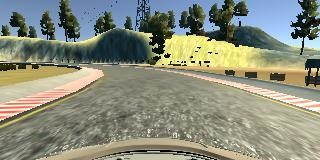
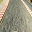

# Behavioral Cloning for Self-driving Car

In this project I am implementing and train Behavioral Cloning network for self-driving car control. Data for training recorded during manual car operation in the [simulator](https://github.com/udacity/self-driving-car-sim).

## Model Architecture
Model architecture that I selected for this project consists of convolutional layer followed by max pooling and dropout layers, which connected to flatten and dense layers:

| Layer (type)        | Output Shape           | Param #  |Connected to|
| ------------- |:-------------:| -------:| --------:|
| convolution2d_1 (Convolution2D)|(None, 30, 30, 32)|896|convolution2d_input_1[0][0]
| maxpooling2d_1 (MaxPooling2D)|(None, 15, 15, 32)|0|convolution2d_1[0][0]
| dropout_1 (Dropout) |(None, 15, 15, 32)|0|maxpooling2d_1[0][0]
activation_1 (Activation)|(None, 15, 15, 32)|0|dropout_1[0][0]
flatten_1 (Flatten)|(None, 7200)|0|activation_1[0][0]
dense_1 (Dense)|(None, 512)|3686912|flatten_1[0][0]
activation_2 (Activation)|(None, 512)|0|dense_1[0][0]
dense_2 (Dense)|(None, 64)|32832|activation_2[0][0]
activation_3 (Activation)|(None, 64)|0|dense_2[0][0]
dense_3 (Dense)|(None, 1)|65|activation_3[0][0]
activation_4 (Activation)|(None, 1)|0|dense_3[0][0]

The convolution layer in the network have filter size 3x3. As unlike P2, where two or three convolution were used to get better result. Here, I think only single convolution layer is enough. And also, using more than one convolution layer doesn't always guarantees better result. 

The filter size and input/output dimension for each layer in the final network is after trial & error.

## Data Preprocessing

I created test data set and also used validation data split for model training. My model also make use of Max Pooling and Dropout layers to reduce over fitting
To train model I used an Adam optimizer with learning rate 0.001.
Training data is recorded during manual operation of car in the simulator.
Recovery data recorded by returning car to the center of the road while it is positioned
at the edges of the track. So when it accidentally drives off the road it will be able to control
steering wheel in such manner that it is returned to the center of the road It shows good stability and stays on track.
To create a training data set, I cropped image to save only significant part
with the road and then reduced the size of image to 32 x 32 pixels
Here is example of what processed image in training set looks like before and after.

Image from the car camera:

Image preprocessed for training model:

The data is normalized to be represented in the range -0.9 .. 1

## Model Training

Hyperparameters tuning done to minimize the loss. I have noticed that accuracy
stays low, even if model successfully rides the track, but better results are achieved
when loss is minimized instead of maximizing accuracy.
I used only 15 training epochs because I noticed that further increasing number
of epochs does not leads to better results.

## Self-driving car

Once the model has been saved, it can be used with drive.py using this command:

`python drive.py model.json`

The above command will load the trained model and use the model to make predictions on individual images in real-time and send the predicted angle back to the server via a websocket connection.

[Recorded Video](video.mp4) of the self-driving car performing full test lap.

## Project Source Code

[model.py](model.py) contains python code with neural network architecture implementation and training

[drive.py](drive.py) contains code for launching simulator in self-driving mode using neural network model saved in file
